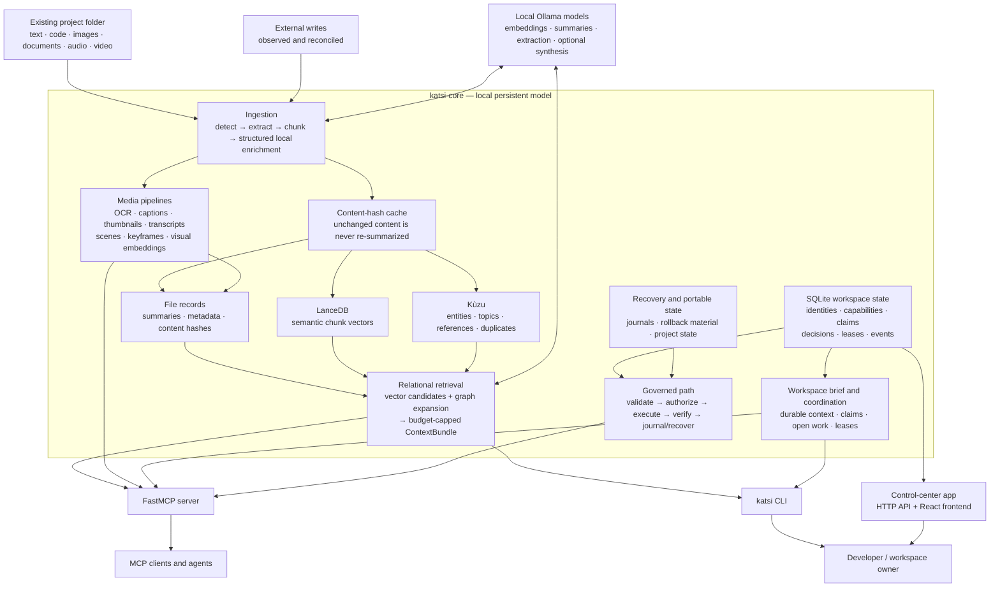

# katsi

[](LICENSE)
[](pyproject.toml)
[](https://modelcontextprotocol.io)

> **Persistent local memory and coordination for AI agents working in real project folders.**

Katsi is an agentic layer over your existing filesystem. It lets agents understand a
codebase, document collection, and **multimedia library** once; retain that
understanding across sessions; coordinate work with other agents; and—where
explicitly authorized—take auditable, recoverable action. Your files remain ordinary
files; Katsi adds the durable model around them.

It starts with a practical problem: every new agent session repeatedly spends tokens
reading the same repository and reconstructing the same decisions. Katsi moves that
exploration to a local, cached ingestion step. It then returns small, relationship-
aware context bundles instead of making a cloud model repeatedly traverse your disk.
Unlike text-only codebase memory tools, its media system can derive searchable,
citable local representations from images, PDFs, audio, and video while keeping
original bytes private.

The name *katsi* means “to know” or “to understand” in Totonac.

## Why Katsi

- **Less agent amnesia.** Files, verified claims, decisions, open work, and recent
  changes persist outside chat history.
- **Lower repeated token cost.** Content is summarized and enriched locally once per
  content hash, then reused until it changes.
- **Better-than-vector retrieval.** Semantic search is combined with a local graph of
  entities, topics, references, and duplicates.
- **Multimedia-native, not an afterthought.** Images, documents, audio, and video
  can become timestamped, page- or region-cited representations—OCR, captions,
  transcripts, scenes, keyframes, thumbnails, and embeddings—through local,
  owner-approved pipelines.
- **Coordination without a proprietary filesystem.** Agents can register identities,
  publish evidence-backed claims, and hold advisory work leases over scoped work.
- **A path toward safe autonomy.** Governed actions are designed around scoped
  capabilities, stale-plan checks, deterministic verification, journaling, rollback,
  and recovery—not an agent merely saying it succeeded.
- **Private by default.** Retrieval, embeddings, extraction, graph work, and local
  synthesis run on your machine. Cloud synthesis is opt-in and receives only a
  curated context bundle.

Katsi is **not** a kernel filesystem, a cloud sync service, or a security sandbox
against programs that write directly to disk. The filesystem remains the authority
for bytes. Katsi observes outside writes as external changes and provides its
stronger guarantees to cooperating agents that use its governed path.

## Contents

- [Requirements](#requirements)
- [Quick start](#quick-start)
- [Architecture](#architecture)
- [Use cases](#use-cases)
- [Multimedia understanding](#multimedia-understanding)
- [Commands](#commands)
- [MCP tools](#mcp-tools)
- [Configuration](#configuration)
- [Development](#development)
- [Project status](#project-status)

## Requirements

Core usage requires:

- **Python 3.12 or 3.13**
- [uv](https://docs.astral.sh/uv/) for installation and workspace commands
- [Ollama](https://ollama.com/) running locally, with the configured models
  available (defaults: `bge-m3` for embeddings and `qwen2.5:7b` for local LLM work)
- Disk space for Katsi’s local data under `~/.katsi` by default

Optional capabilities:

- `markitdown[pdf]` for PDF extraction (`uv sync --extra pdf`)
- Node.js and npm for the dashboard frontend in `packages/app/frontend`
- An API key only when you intentionally enable cloud synthesis

## Quick start

### Install from a checkout

```bash
git clone https://github.com/jeanethS/katsi.git
cd katsi
uv sync

# Start the local model service and pull the default models.
ollama serve
ollama pull bge-m3
ollama pull qwen2.5:7b
```

In another terminal, index a project and ask for its context:

```bash
uv run --package katsi-cli katsi index /path/to/project
uv run --package katsi-cli katsi ask "What is this project for?"
```

The default `ask` mode prints a compact context bundle for your client to
synthesize over. It does not send your workspace to a cloud model.

### Connect an MCP client

Run the server directly from the checkout:

```bash
uv run --package katsi-mcp katsi-mcp
```

For Claude Code, register that command as a local MCP server:

```bash
claude mcp add katsi -s local -- \
  uv run --project /path/to/katsi --package katsi-mcp katsi-mcp
```

For Claude Desktop or another stdio MCP client, use the equivalent command and
arguments. A published installation can be started with `uvx katsi-mcp`.

## Architecture

Katsi has two connected layers: **relational retrieval** (available today) and a
**living workspace model** for durable multi-agent coordination.



| Component | Responsibility |
|---|---|
| `packages/core/katsi_core` | Domain models, configuration, local clients and stores, ingestion, retrieval, workspace state, and governed-operation primitives. It intentionally has no MCP or CLI imports. |
| `packages/mcp_server` | FastMCP interface for agents and MCP clients. |
| `packages/cli` | The `katsi` command-line interface for indexing, retrieval, and workspace-owner operations. |
| `packages/app` | HTTP backend and React/Vite control-center frontend. |

### Local storage model

All project understanding and workspace control state stays local by default. Each
store has one responsibility, avoiding a single opaque “AI database.”

| Local store | What it keeps | Why it exists |
|---|---|---|
| **FileRecordStore** | Per-file paths, content hashes, summaries, extraction/index status, and metadata. | It is the canonical record of what Katsi knows about each indexed file and enables summarize-once behavior. |
| **LanceDB** | Embeddings for source chunks and compatible text-derived media representations. | It finds semantically relevant content even when a query does not share exact words. |
| **Kùzu** | Entities, topics, references, and duplicate relationships between files. | It expands a search beyond the nearest vector matches and explains why files are related. |
| **SQLite workspace database** | Workspaces, identities, credentials/capabilities, claims, decisions, leases, events, change sets, projection state, and enrichment-cache data. | It is the durable control plane for multi-agent memory, authorization, and coordination. |
| **Recovery blob store** | Recoverable preimages and derived artifacts used by governed operations. | It supports rollback and recovery instead of treating a failed mutation as irreversible. |
| **Portable project-state JSON** | Owner-approved, portable project context at `.katsi/project-state.json`. | It lets selected intent and verified project context travel with a project without exporting private authority or raw agent reasoning. |

### Basic agent workflow


## Use cases

Katsi is useful whenever an agent needs to work repeatedly in a long-lived local
folder—especially when the answer depends on relationships across code, documents,
and media rather than a single file.

### Use now: local understanding and retrieval

| Use case | How Katsi helps | Typical starting point |
|---|---|---|
| **Codebase onboarding** | Gives a new coding agent a curated map of purpose, important files, concepts, and cross-file relationships instead of a blind recursive read. | Index the repository, then call `get_context("How is authentication implemented?")`. |
| **Persistent project memory** | Reuses content-hash-cached summaries and graph relations across sessions, eliminating repeated rediscovery of stable project knowledge. | `katsi index PATH`, then `get_context` or `katsi ask`. |
| **Architecture and dependency investigation** | Connects semantic hits to shared entities, topics, references, and duplicates, revealing related implementation files that keyword search misses. | `search_files`, followed by `related(file_id)`. |
| **Documentation and knowledge-base Q&A** | Retrieves a bounded source-grounded bundle from Markdown, text, Office documents, and PDFs rather than prompting with an entire document library. | Index the knowledge folder, then `get_context(QUESTION)`. |
| **Private local RAG** | Keeps indexing, embedding, extraction, stores, and default retrieval on-device; a cloud answer model is optional rather than required. | Use the default `return_only` synthesis mode. |
| **Cost-conscious agent work** | Moves exploration from repeated cloud context-window usage to a local, one-time enrichment operation per content hash. | Index once; reuse `get_context` for successive tasks. |

### Use now: multimedia understanding

| Use case | How Katsi helps | Evidence an agent receives |
|---|---|---|
| **Searchable design and screenshot libraries** | Converts configured local image collections into OCR, captions, thumbnails, and visual embeddings. | Cited image regions and bounded previews. |
| **PDF, slide, and spreadsheet research** | Detects documents by content, extracts text, and supports rendered/page-level OCR pipelines. | Text with page-aware locators and coverage. |
| **Meeting, interview, and field-recording review** | Produces local metadata, normalized audio, time-coded transcripts, and optional speaker segmentation through registered adapters. | Bounded transcript segments with millisecond ranges. |
| **Video archive exploration** | Derives metadata, proxy media, scenes, keyframes, captions, and visual embeddings where pipelines are configured. | Cited scenes and frame timestamps—not an unbounded video dump. |
| **Privacy-sensitive media work** | Keeps originals and derived blobs private, gates sensitive metadata through capabilities, and treats all extracted media text as untrusted evidence. | Capability-checked previews or original-resource metadata. |

### Use now: multi-agent workspace coordination

| Use case | How Katsi helps | Typical workflow |
|---|---|---|
| **Handoffs across agent sessions** | A Workspace Brief carries durable intent, claims, decisions, blockers, current work, leases, and recent events into the next session. | `open_workspace` → `get_workspace_brief`. |
| **Parallel work without accidental overlap** | Advisory, time-bounded work leases make active scope visible to cooperating agents. | Inspect work/leases → `acquire_work_lease` → work → `release_work_lease`. |
| **Evidence-backed shared knowledge** | Agents publish inspectable claims with provenance and lifecycle status instead of writing unqualified assertions into shared memory. | `publish_claim` → `list_claims` / `inspect_decisions`. |
| **Workspace-owner control** | Identities and revocable scoped capabilities establish who may read, claim, lease, or use governed operations. | Issue an identity, grant only needed capability classes, then configure its credential. |
| **Portable project context** | Owner-approved project state can travel with a workspace without copying private local authority or raw agent reasoning. | `katsi export-state` / `katsi import-state`. |

### Intended governed-action use cases

The repository includes the building blocks for governed operations: scoped
capabilities, action journals, verification, rollback material, and recovery. The
long-term use cases are safe agent-driven refactors, migrations, generated artifacts,
and media derivatives whose inputs, authorization, checks, and outcomes can be
audited. Treat end-to-end autonomous Change Set execution as an evolving capability,
not a blanket promise for arbitrary filesystem mutations. See the
[agentic filesystem vision](docs/agentic-filesystem-vision.md) for the trust model.

### Data flow

1. **Ingest:** Katsi extracts supported text and media, chunks textual material, and
   asks local models for structured summaries and entities/topics. Media adapters
   derive cited OCR, captions, transcripts, scenes, or keyframes as configured.
   Results are cached by content hash; unchanged files are not re-summarized.
2. **Store:** chunks go to embedded LanceDB; relationships go to embedded Kùzu; file
   records and workspace authority/state are kept locally.
3. **Retrieve:** a query produces vector candidates, expands meaningful graph
   neighbors, and packs the most useful summaries and raw chunks into a bounded
   `ContextBundle`.
4. **Coordinate:** cooperating agents can open a workspace, receive a concise brief,
   publish claims with provenance, inspect decisions/blockers, and acquire leases.
5. **Govern (where enabled):** owner-scoped identities and capabilities constrain
   actions; the intended lifecycle is validate → authorize → execute → verify →
   journal/recover.

For the product thesis and trust boundaries, see [the agentic filesystem vision](docs/agentic-filesystem-vision.md).

## Multimedia understanding

Katsi can turn local images, documents, audio, and video into **citable derived
representations**—rather than dropping raw assets or full transcripts into an
agent’s context. This is a core distinction: media is not flattened into an opaque
attachment or sent wholesale to a remote model. A result preserves where its evidence
came from, such as an image region, PDF page, audio range, or video frame.

Multimedia processing is local-first and opt-in: a workspace owner enables MIME
patterns and registers only the available local pipeline adapters. Text-only
installations continue to work with no media dependencies.

For speech, Katsi’s configured **Whisper-family adapter** runs locally to produce
strictly validated, time-coded transcript segments for audio and video tracks. This
makes recordings searchable and citeable by millisecond range. Whisper is neither a
cloud dependency nor automatically enabled: the owner must install and register the
adapter. If transcription is unavailable or incomplete, Katsi records that coverage
honestly rather than fabricating transcript text.

| Media family | Content-safe detection | Available derived representations |
|---|---|---|
| Images (`PNG`, `JPEG`, `GIF`, `BMP`, `WebP`, `TIFF`) | Magic-number inspection, dimensions, and extension-mismatch warnings | Thumbnails, OCR text, image captions, visual embeddings |
| Documents (`PDF`, `DOCX`, `PPTX`, `XLSX`) | Content signatures and Office-container inspection; encrypted files are identified | Extracted text, rendered/proxy media, page-level OCR |
| Audio (`MP3`, `WAV`, `FLAC`, `OGG`, `M4A`) | Content signatures and structural metadata | Metadata, normalized proxy media, time-coded transcript segments, optional speaker segmentation |
| Video (`MP4`, `MOV`, `M4V`, `WebM`, `MKV`, `AVI`) | Content signatures and bounded container inspection | Media descriptor, proxy media, scenes, keyframes, and caption/visual-embedding derivatives through registered pipelines |

Each representation records its producer, fingerprint, status, coverage, and a
typed locator: normalized image regions, PDF pages, audio millisecond ranges, or
video-frame timestamps. The fingerprint includes the model/prompt and sampling
policy, so changing those inputs produces a fresh representation instead of silently
reusing incompatible output.

### Privacy and access

- Original bytes and generated blobs stay private. Standard context bundles return
  a bounded preview or thumbnail reference, not base64 payloads, full-resolution
  images, or entire transcripts.
- OCR, captions, subtitles, metadata, and transcripts are **untrusted evidence**;
  they never grant instructions, policy, or authority to an agent.
- Location, biometric-like, and personal metadata are excluded from ordinary
  search/context surfaces unless the agent has a matching capability grant.
- `get_media_preview` returns a bounded, citation-first view. `open_media_original`
  exposes original-resource metadata only after a capability check.

See [the multimedia guide](docs/media.md) for pipeline configuration, diagnostics,
and coverage semantics.

## Commands

Run commands from a local checkout with `uv run --package katsi-cli katsi …`.
`uv sync` does not place workspace-member scripts directly in the root environment,
so `--package` is important.

### Retrieval and indexing

| Command | What it does |
|---|---|
| `katsi index PATH` | Recursively index a file or directory using configured include/exclude globs. |
| `katsi status` | Show indexed-file counts, chunk counts, and recent indexing state. |
| `katsi search QUERY --top 8` | Return ranked files and why each is relevant. |
| `katsi ask QUERY --max-tokens 3000` | Print a budgeted relational context bundle. |
| `katsi ask QUERY --mode local` | Synthesize an answer with the configured local Ollama model. |
| `katsi ask QUERY --mode auto` | Use the configured automatic synthesis policy. |

### Workspace owner operations

| Command | What it does |
|---|---|
| `katsi workspace PATH --name NAME` | Register or inspect a workspace identity. |
| `katsi export-state WORKSPACE_ID -o state.json` | Export portable, owner-approved project state. |
| `katsi import-state WORKSPACE_ID state.json` | Import portable project state. |
| `katsi issue-identity --name NAME --client CLIENT` | Create an agent identity and display its credential once. |
| `katsi rotate-credential ID` / `katsi revoke-identity ID` | Rotate a credential or disable an identity. |
| `katsi grant-capability ID WORKSPACE_ID read,claim,lease` | Grant scoped operation classes and a risk limit. |
| `katsi revoke-grant ID` / `katsi inspect-capabilities ID` | Manage and audit active grants. |

Use `katsi --help` or `katsi COMMAND --help` for flags and exact argument details.

## MCP tools

The server exposes 21 tools across retrieval, first-class media access, and durable
workspace coordination.

### Retrieval and index

| Tool | Purpose |
|---|---|
| `get_context(query, max_tokens=3000)` | Primary retrieval API: returns a budget-capped context bundle with summaries, chunks, and a relationship sketch. |
| `search_files(query, k=8)` | Return ranked files with relevance reasons. |
| `related(file_id, kinds?)` | Inspect graph neighbors such as shared entities, topics, references, or duplicates. |
| `get_file_summary(file_id)` | Get a cached summary and metadata. |
| `index_file_tool(path)` / `index_status()` | Index one file or inspect index health. |
| `answer(query, mode?)` | Optional server-side synthesis. Disabled unless `enable_answer_tool` is configured. |

### Media

| Tool | Purpose |
|---|---|
| `get_media_preview(workspace_id, representation_id, max_chars=480)` | Return a bounded, citation-first preview of a derived media representation, without returning media bytes. |
| `open_media_original(workspace_id, resource_version_id)` | Capability-check and resolve metadata for the original resource; never returns the original bytes. |

### Workspace memory and coordination

| Tool | Purpose |
|---|---|
| `open_workspace(root_path)` | Open an existing workspace or register a folder as one. |
| `inspect_workspace(workspace_id)` | Inspect workspace identity, state, and recent events. |
| `get_workspace_brief(workspace_id, byte_budget=100000)` | Assemble task-scoped durable context for an authenticated agent. |
| `publish_claim(...)` | Submit a provenance-backed claim for a workspace. |
| `list_claims(workspace_id, status?)` | List claims, optionally by lifecycle status. |
| `inspect_decisions(workspace_id, status?)` | Inspect recorded decisions and their status. |
| `inspect_blockers(workspace_id)` | List unresolved blockers. |
| `inspect_open_work(workspace_id)` | List tracked work that remains open. |

### Work leases

| Tool | Purpose |
|---|---|
| `acquire_work_lease(...)` | Acquire an advisory, time-bounded lease for a declared work scope. |
| `renew_work_lease(lease_id, expected_expires_at)` | Renew an active lease before it expires. |
| `release_work_lease(lease_id)` | Release a lease when the work is complete or abandoned. |
| `inspect_active_leases(workspace_id)` | Inspect the active leases in a workspace. |

## Configuration

Configuration is optional. Katsi loads `katsi.toml` from the current directory,
then `~/.katsi/katsi.toml`; `KATSI_` environment variables override settings.

```toml
[katsi.ollama]
host = "http://localhost:11434"
embed_model = "bge-m3"
llm_model = "qwen2.5:7b"

[katsi.ingest]
chunk_token_target = 512
chunk_token_overlap = 64

[katsi.retrieve]
top_k_chunks = 16
top_k_files = 8
default_context_max_tokens = 3000

[katsi.mcp]
enable_answer_tool = false

[katsi.synth]
backend = "return_only" # return_only | local | cloud | auto
```

The default is `return_only`: Katsi retrieves locally and lets the calling MCP
client synthesize. `local` uses Ollama. `cloud` and `auto` are explicit opt-in
modes; configure the provider, model, and API-key environment variable under
`[katsi.synth.cloud]` before using them.

## Development

```bash
# Python quality checks
uv run pytest
uv run ruff check .
uv run ruff format .

# MCP server, CLI, and API backend
uv run --package katsi-mcp katsi-mcp
uv run --package katsi-cli katsi --help
uv run --package katsi-app katsi-app

# Frontend (separate Node workspace)
cd packages/app/frontend
npm install
npm run dev
npm run test
npm run build
```

Tests fake or fixture external services; CI should not need a live Ollama,
LanceDB, or Kùzu instance.

## Project status

Katsi is an early-stage project. Relational retrieval, local ingestion, workspace
records, claims, identities, capabilities, leases, and related recovery/governance
building blocks live in this repository. The fuller long-term model—including
end-to-end governed Change Sets and broader control-center workflows—is documented
in the [vision](docs/agentic-filesystem-vision.md) and ADRs under `docs/adr/`.

## License

[MIT](LICENSE)
